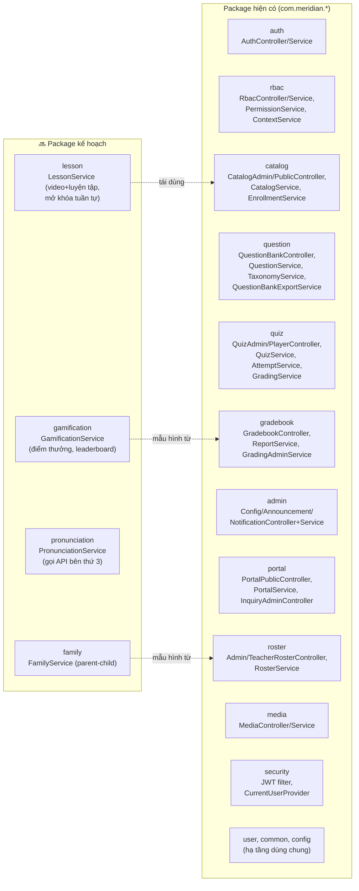
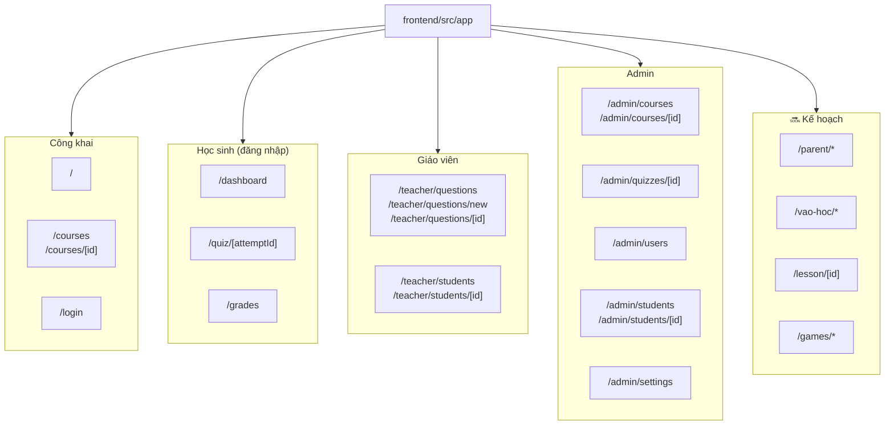
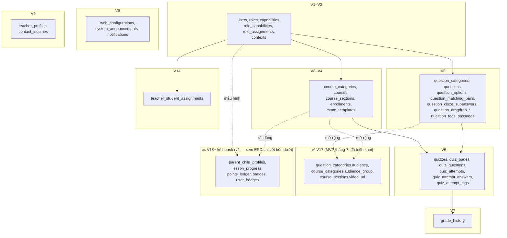
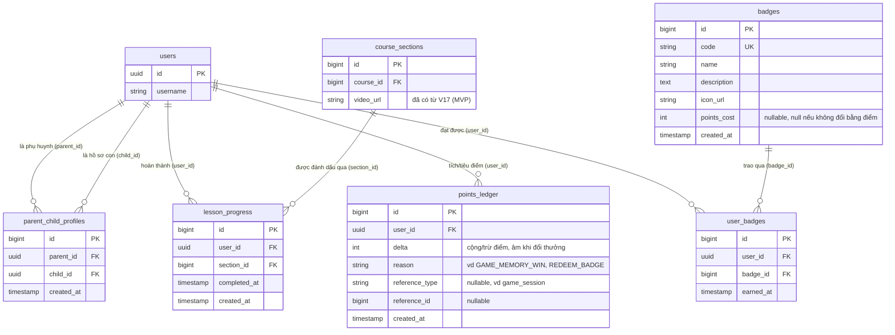
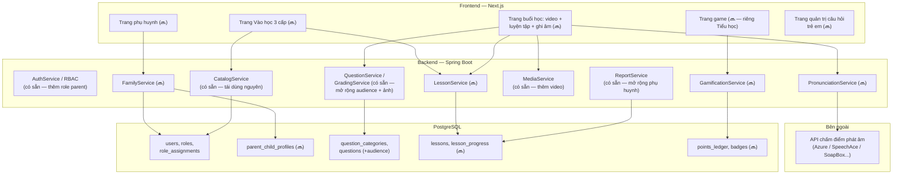
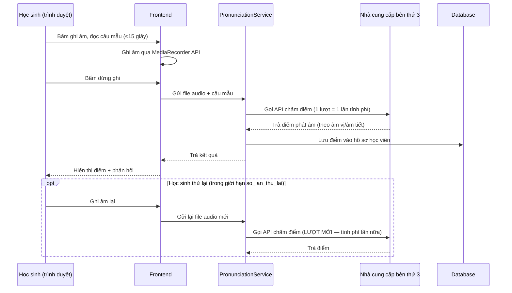
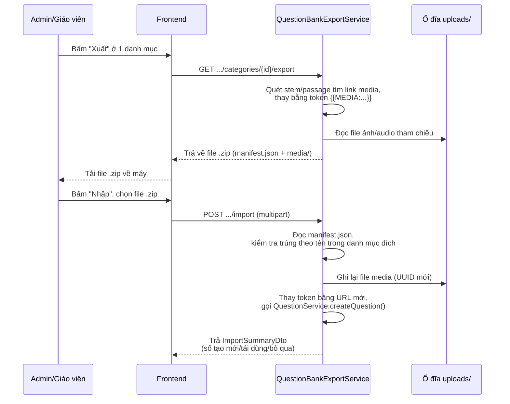

# Sơ đồ kỹ thuật — Anh ngữ Meridian

*Dành cho đội kỹ thuật: kiến trúc backend, mô hình dữ liệu, route, luồng dữ liệu API. Bản dành cho BA/phi kỹ thuật (không có tên package/class/route/ERD) xem [So_do_Tong_Quat_Nghiep_Vu.md](./So_do_Tong_Quat_Nghiep_Vu.md). Bao quát cả nền tảng hiện có (Phase 1–9, production) và phần mở rộng đang lên kế hoạch (Phase 10–20, đánh dấu 🔜). Route/package/bảng đối chiếu trực tiếp mã nguồn tại thời điểm viết. Cú pháp [Mermaid](https://mermaid.js.org/) — hiện trực tiếp trên GitHub/VS Code/Obsidian; nếu không, dán vào [mermaid.live](https://mermaid.live).*

---

## 1. Kiến trúc Backend (14 package hiện có + 4 package kế hoạch)

---

## 2. Route map (Next.js App Router — path chính xác)

---

## 3. Mô hình dữ liệu (nhóm theo migration Flyway, 17 migration hiện có + kế hoạch)

*V10–V13, V15–V16 là migration chỉnh sửa nhỏ (đổi đăng nhập sang username, thêm sort order, thêm trường giải thích câu hỏi, thêm cấu hình trang chủ) — không tạo module dữ liệu mới nên không tách riêng.*

### 3.1. ERD chi tiết — các bảng còn lại cho v2 (Phase 11 hồ sơ phụ huynh, Phase 19 game hóa)

*Vẽ theo Task #4 của Phase 10 ([Ke_hoach_Mo_rong_Tre_em_va_Tieu_hoc_V1.md](./Ke_hoach_Mo_rong_Tre_em_va_Tieu_hoc_V1.md)). Không vẽ lại `lesson`/`lesson_progress` riêng cho Phase 12 — xem ghi chú "Quyết định kiến trúc" ngay dưới đây, lý do không cần bảng `lesson` mới.*

**Quyết định kiến trúc — không tạo bảng `lesson` mới cho Phase 12:** kế hoạch gốc đề xuất 1 entity `Lesson` riêng dưới `CourseSection`. Nhưng MVP tháng 7 (đã triển khai production) đã dùng thẳng `CourseSection` làm đơn vị "bài học" (thêm cột `video_url` trực tiếp, 1 section = 1 bài). Vì thực tế đã chạy đúng mô hình này, v2 **tiếp tục dùng `CourseSection` làm bài học**, không tạo `Lesson` trùng lặp — chỉ thêm bảng `lesson_progress` (mô phỏng `quiz_attempts`) để lưu trạng thái hoàn thành + tính logic mở khóa tuần tự (section N mở khi có `lesson_progress` cho section N-1, tính lúc truy vấn — không lưu cờ khóa/mở riêng để tránh dữ liệu cũ sai lệch).

**Điểm cần chốt khi code Phase 12:** thời điểm ghi `lesson_progress.completed_at` — đề xuất: tự động đánh dấu hoàn thành ngay khi học sinh **nộp bài luyện tập** (`QuizAttempt` của quiz gắn với section đó chuyển sang `SUBMITTED`/`GRADED`, không yêu cầu điểm tối thiểu vì đây là luyện tập chứ không phải bài thi). Với bài chỉ có video không có luyện tập, cần thêm 1 nút "Hoàn thành" gọi API đánh dấu trực tiếp.

**Không tạo bảng leaderboard riêng:** tính bảng xếp hạng bằng truy vấn `SUM(delta) GROUP BY user_id` trên `points_ledger` tại thời điểm đọc, tránh đồng bộ 2 nguồn dữ liệu. Nếu sau này số liệu lớn ảnh hưởng hiệu năng mới cân nhắc thêm bảng tổng hợp/cache.

**Đối chiếu không xung đột schema hiện có (Task #5 Phase 10):** `parent_child_profiles`/`lesson_progress`/`points_ledger`/`badges`/`user_badges` là tên bảng mới, không trùng bảng nào trong 17 migration hiện có. `parent_id`/`child_id`/`user_id` đều FK vào `users.id` (UUID) theo đúng kiểu khóa chính hiện tại — không cần đổi kiểu dữ liệu ở bảng `users`.

---

## 4. Kiến trúc hệ thống mở rộng — chi tiết luồng dữ liệu (Frontend/Backend/DB/External)

---

## 5. Sequence diagram: chấm điểm phát âm (Phase 17 🔜)

*Chi tiết giá theo lượt gọi API: xem [Tom_tat_Chi_phi_va_Deadline_Mo_rong_Tre_em_Tieu_hoc.md](./Tom_tat_Chi_phi_va_Deadline_Mo_rong_Tre_em_Tieu_hoc.md) mục 3.*

---

## 6. Sequence diagram: xuất/nhập ngân hàng câu hỏi (đã triển khai)

---

## Ghi chú

- Mọi tên package/class/route/bảng dữ liệu ở trên đối chiếu trực tiếp mã nguồn tại thời điểm viết — nếu code thay đổi sau này, cần cập nhật lại sơ đồ.
- Phần đánh dấu 🔜 **chưa tồn tại trong mã nguồn** — là thiết kế đề xuất, có thể đổi khi vào Phase 10 (chốt schema).
- Bản dành cho BA/phi kỹ thuật (luồng trải nghiệm người dùng, không có thuật ngữ code): [So_do_Tong_Quat_Nghiep_Vu.md](./So_do_Tong_Quat_Nghiep_Vu.md).
