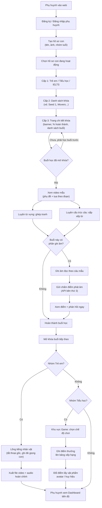
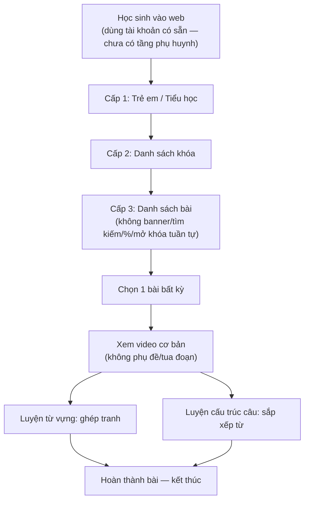
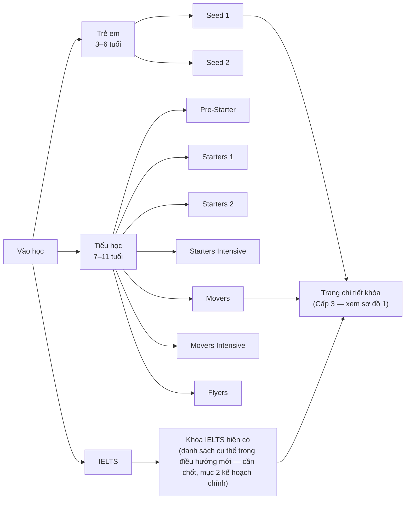
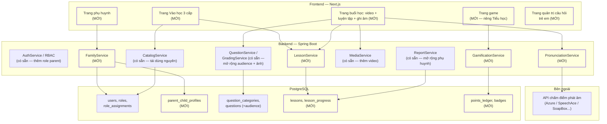
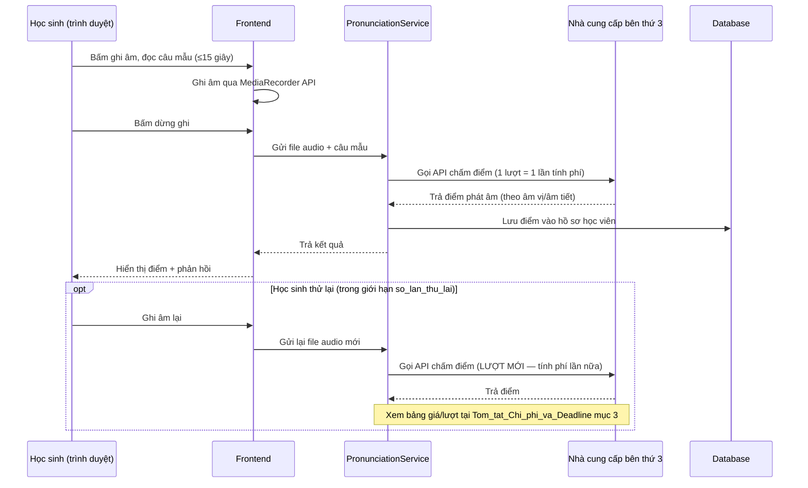
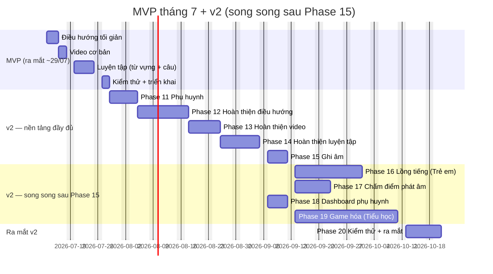

# Sơ đồ luồng chi tiết: Mở rộng Trẻ em & Tiểu học

*Trực quan hóa [Ke_hoach_Mo_rong_Tre_em_va_Tieu_hoc_V1.md](./Ke_hoach_Mo_rong_Tre_em_va_Tieu_hoc_V1.md) — chỉ riêng phần mở rộng. Muốn xem sơ đồ **toàn bộ dự án** (cả nền tảng hiện có + phần mở rộng) xem [So_do_Tong_The_Toan_Du_an.md](./So_do_Tong_The_Toan_Du_an.md). Toàn bộ sơ đồ dùng cú pháp [Mermaid](https://mermaid.js.org/) — hiện đúng trên GitHub, VS Code (extension "Markdown Preview Mermaid Support"), Obsidian, GitLab. Nếu trình xem không hỗ trợ, dán khối code vào [mermaid.live](https://mermaid.live) để xem hình.*

---

## 1. Luồng người dùng tổng thể (phạm vi đầy đủ — v2)

Từ lúc phụ huynh vào web tới lúc xem báo cáo tiến độ — bao gồm cả 2 nhánh đặc thù riêng nhóm (lồng tiếng cho Trẻ em, game hóa cho Tiểu học).

---

## 2. Luồng MVP tháng 7 (phạm vi rút gọn, ra mắt thật đầu tiên)

Đối chiếu với sơ đồ 1 — cắt hẳn nhánh phụ huynh/hồ sơ con, ghi âm, lồng tiếng, chấm điểm phát âm, game hóa. Chi tiết phạm vi xem [Tom_tat_Chi_phi_va_Deadline_Mo_rong_Tre_em_Tieu_hoc.md](./Tom_tat_Chi_phi_va_Deadline_Mo_rong_Tre_em_Tieu_hoc.md) mục 0.

**Phần bị cắt so với v2** (không xuất hiện trong sơ đồ trên): tạo hồ sơ con, mở khóa tuần tự, phụ đề/tua video, ghi âm, chấm điểm phát âm, lồng tiếng, game hóa, dashboard phụ huynh — toàn bộ dời sang v2.

---

## 3. Điều hướng "Vào học" 3 cấp — chi tiết đầy đủ tên khóa

---

## 4. Kiến trúc hệ thống — thành phần có sẵn (tái dùng) vs xây mới

*Khối viền đậm = xây mới (MỚI); khối viền thường = tái dùng hệ thống hiện có. Toàn bộ nhóm IELTS/học sinh-sinh viên hiện tại chạy qua đúng các khối "có sẵn" này, không đổi hành vi.*

---

## 5. Luồng chi tiết: Chấm điểm phát âm (Phase 17) — vì đây là nơi phát sinh chi phí thật

---

## 6. Dòng thời gian: MVP tháng 7 + v2 (kịch bản chạy song song)

Dùng đúng ngày trung tâm đã tính trong [Tom_tat_Chi_phi_va_Deadline_Mo_rong_Tre_em_Tieu_hoc.md](./Tom_tat_Chi_phi_va_Deadline_Mo_rong_Tre_em_Tieu_hoc.md) — bắt đầu minh họa 13/07/2026, cần thay bằng ngày bắt đầu thực tế.

**Đọc nhanh:** Phase 16/17/19 chạy cùng lúc (song song) sau khi Phase 15 xong; Phase 18 chèn vào ngay sau Phase 14, không nằm trên đường găng. Phase 20 chỉ bắt đầu khi cả 4 giai đoạn song song đều xong — bị giới hạn bởi Phase 19 (dài nhất).

---

## Ghi chú

- Tất cả sơ đồ trên phản ánh **điểm ước tính trung tâm** (không phải khoảng thấp–cao) — xem [Tom_tat_Chi_phi_va_Deadline_Mo_rong_Tre_em_Tieu_hoc.md](./Tom_tat_Chi_phi_va_Deadline_Mo_rong_Tre_em_Tieu_hoc.md) mục 4 về độ tin cậy của các con số thời gian.
- Sơ đồ 4 (kiến trúc hệ thống) là **đề xuất thiết kế**, chưa phải quyết định cuối — cần chốt cùng lúc với Phase 10 (thiết kế schema).
- Muốn xem hình trực quan ngay trong lúc trao đổi (không cần mở file): đã hiển thị 2 sơ đồ tóm tắt (điều hướng 3 cấp + kiến trúc hệ thống) ở phần trả lời trong chat.
