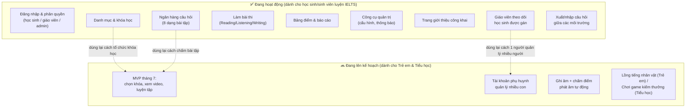
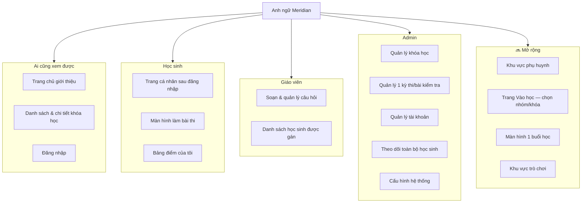
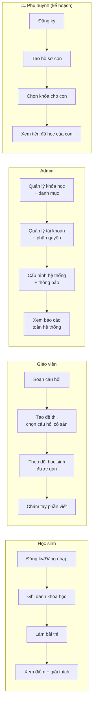
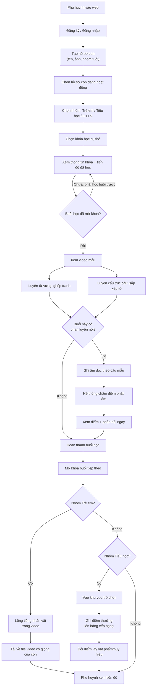
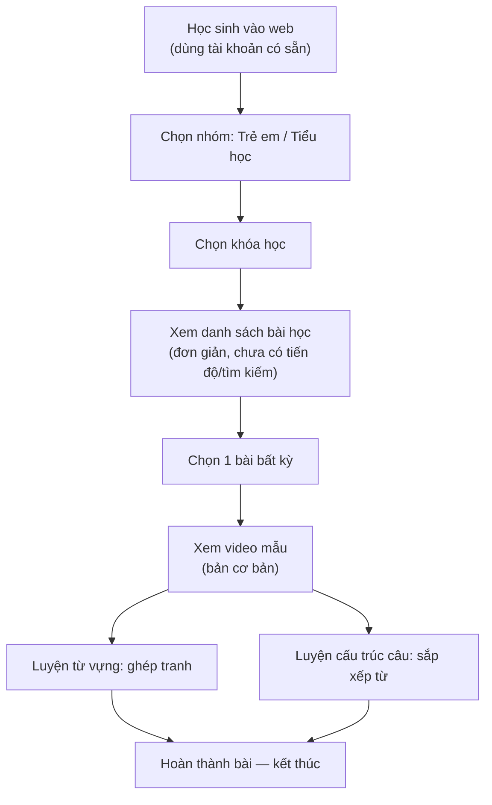
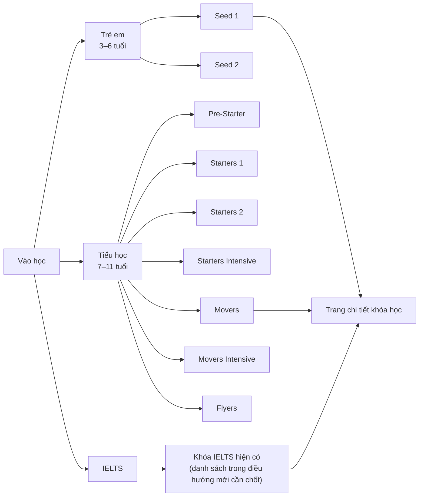
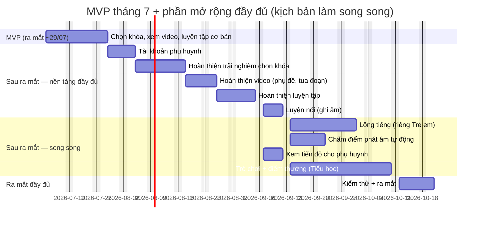

# Sơ đồ tổng quát nghiệp vụ — Anh ngữ Meridian

*Dành cho BA/phía sản phẩm: mô tả **luồng hoạt động, trải nghiệm người dùng, phạm vi chức năng** — không có tên package/class/route/bảng dữ liệu. Bản kỹ thuật (kiến trúc backend, ERD, sequence diagram) xem [So_do_Ky_thuat.md](./So_do_Ky_thuat.md). Bao quát cả nền tảng hiện có (đang chạy) và phần mở rộng đang lên kế hoạch (đánh dấu 🔜). Cú pháp [Mermaid](https://mermaid.js.org/) — hiện trực tiếp trên GitHub; nếu không, dán vào [mermaid.live](https://mermaid.live).*

---

## 1. Bức tranh toàn cảnh — các nhóm chức năng

**Ý nghĩa:** phần "Đang hoạt động" không đổi gì khi triển khai phần mở rộng — 2 nhóm chạy song song, chỉ 3 chỗ có mũi tên chấm là tận dụng lại cách làm đã có.

---

## 2. Các màn hình chính người dùng thấy (theo vai trò)

---

## 3. Luồng theo vai trò (3 vai trò hiện có + 1 vai trò kế hoạch)

---

## 4. Luồng trải nghiệm đầy đủ — Trẻ em & Tiểu học (🔜 v2)

---

## 5. Luồng trải nghiệm MVP tháng 7 (phạm vi ra mắt thật đầu tiên)

**Phần chưa có ở MVP** (so với luồng đầy đủ ở mục 4): hồ sơ phụ huynh/con, mở khóa tuần tự theo tiến độ, phụ đề/tua video, luyện nói + chấm điểm phát âm, lồng tiếng, trò chơi, xem tiến độ cho phụ huynh — tất cả dời sang giai đoạn sau khi ra mắt.

---

## 6. Điều hướng "Vào học" — 3 bước chọn khóa

---

## 7. Lộ trình phát triển (mốc thời gian, không đi vào chi tiết kỹ thuật)

*Chi tiết số ngày/deadline theo từng mốc: xem [Tom_tat_Chi_phi_va_Deadline_Mo_rong_Tre_em_Tieu_hoc.md](./Tom_tat_Chi_phi_va_Deadline_Mo_rong_Tre_em_Tieu_hoc.md).*

---

## Ghi chú

- Sơ đồ trên mô tả **trải nghiệm và luồng nghiệp vụ**, không phải cách hệ thống được xây (không có tên package/class/route/bảng dữ liệu) — dùng để trao đổi với các bên không rành kỹ thuật.
- Phần đánh dấu 🔜 là thiết kế đề xuất, chưa triển khai.
- Bản kỹ thuật tương ứng (kiến trúc, dữ liệu, luồng API): [So_do_Ky_thuat.md](./So_do_Ky_thuat.md).
- Kế hoạch/giá/deadline chi tiết: [Ke_hoach_Mo_rong_Tre_em_va_Tieu_hoc_V1.md](./Ke_hoach_Mo_rong_Tre_em_va_Tieu_hoc_V1.md), [Tom_tat_Kha_thi_Mo_rong_Tre_em_Tieu_hoc.md](./Tom_tat_Kha_thi_Mo_rong_Tre_em_Tieu_hoc.md).
