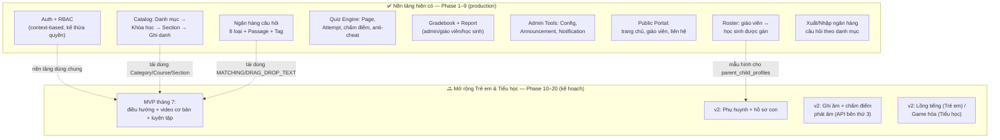
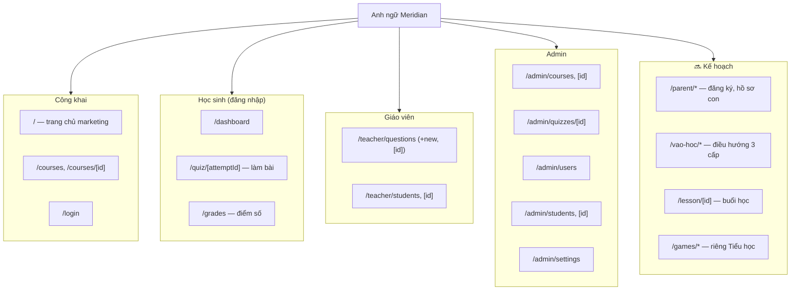
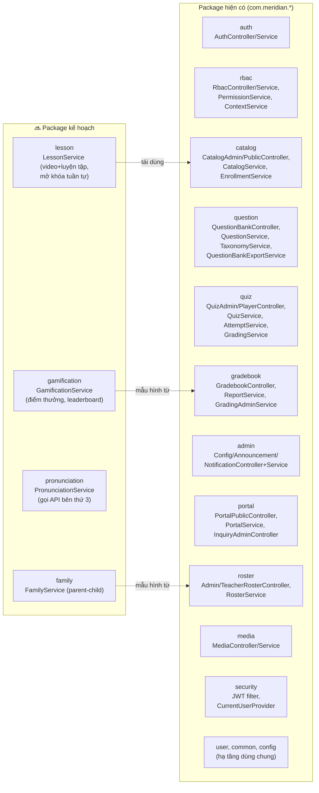
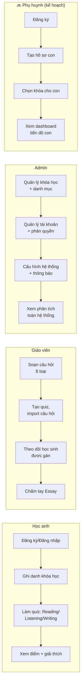
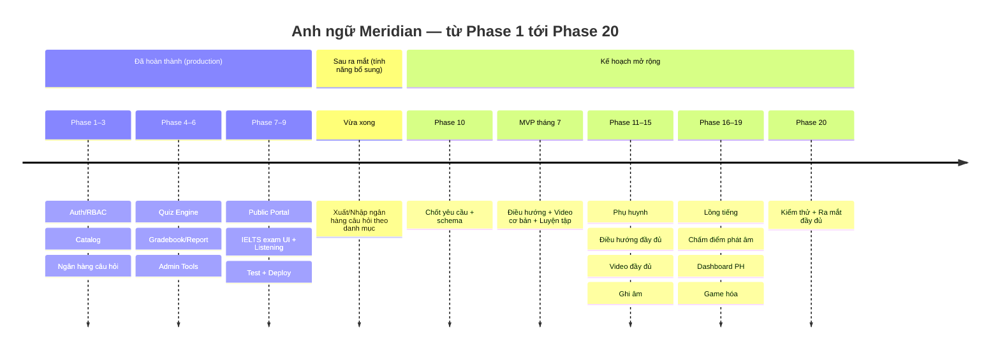

# Sơ đồ tổng thể toàn dự án — Anh ngữ Meridian

*Bao quát **toàn bộ hệ thống**: nền tảng hiện có (Phase 1–9, đã hoàn thành, đang chạy production) + hướng mở rộng Trẻ em/Tiểu học (Phase 10–20, đang lên kế hoạch). Sơ đồ riêng chỉ về phần mở rộng xem [So_do_Luong_Du_an_Mo_rong_Tre_em_Tieu_hoc.md](./So_do_Luong_Du_an_Mo_rong_Tre_em_Tieu_hoc.md). Danh sách route/package dưới đây đối chiếu trực tiếp với mã nguồn hiện tại (không phải nhớ lại) — chính xác tại thời điểm viết. Cú pháp [Mermaid](https://mermaid.js.org/) — hiện trực tiếp trên GitHub/VS Code/Obsidian; nếu không, dán vào [mermaid.live](https://mermaid.live).*

---

## 1. Bức tranh toàn cảnh

**Ý nghĩa:** phần "Đã có" chạy độc lập, không đổi hành vi khi mở rộng. Phần "Kế hoạch" xây thêm bên cạnh, tái dùng tối đa 4 khối đã đánh dấu mũi tên chấm.

---

## 2. Sitemap Frontend đầy đủ (đối chiếu trực tiếp mã nguồn)

---

## 3. Kiến trúc Backend đầy đủ (14 package hiện có + 4 package kế hoạch)

---

## 4. Mô hình dữ liệu tổng thể (nhóm theo module, 16 migration hiện có + kế hoạch)

```mermaid
flowchart TB
    subgraph M1["V1–V2 — RBAC"]
        T1["users, roles, capabilities,<br/>role_capabilities, role_assignments,<br/>contexts"]
    end
    subgraph M2["V3–V4 — Catalog"]
        T2["course_categories, courses,<br/>course_sections, enrollments,<br/>exam_templates"]
    end
    subgraph M3["V5 — Ngân hàng câu hỏi"]
        T3["question_categories, questions,<br/>question_options, question_matching_pairs,<br/>question_cloze_subanswers, question_dragdrop_*,<br/>question_tags, passages"]
    end
    subgraph M4["V6 — Quiz Engine"]
        T4["quizzes, quiz_pages, quiz_questions,<br/>quiz_attempts, quiz_attempt_answers,<br/>quiz_attempt_logs"]
    end
    subgraph M5["V7 — Gradebook"]
        T5["grade_history"]
    end
    subgraph M6["V8 — Admin Tools"]
        T6["web_configurations,<br/>system_announcements, notifications"]
    end
    subgraph M7["V9 — Public Portal"]
        T7["teacher_profiles,<br/>contact_inquiries"]
    end
    subgraph M8["V14 — Roster"]
        T8["teacher_student_assignments"]
    end
    subgraph M9["🔜 Kế hoạch — Family/Lesson/Gamification"]
        T9["parent_child_profiles,<br/>lessons, lesson_progress,<br/>points_ledger, badges"]
    end

    T1 --> T2
    T1 --> T3
    T2 --> T4
    T3 --> T4
    T4 --> T5
    T1 --> T8
    T1 -.mẫu hình.-> T9
    T2 -.tái dùng.-> T9
```

*V10–V13, V15–V16 là các migration chỉnh sửa nhỏ (đổi sang đăng nhập bằng username, thêm sort order, thêm trường giải thích câu hỏi, thêm cấu hình trang chủ) — không tạo module dữ liệu mới nên không tách riêng ở đây.*

---

## 5. Luồng theo vai trò (4 lane — 3 hiện có + 1 kế hoạch)

---

## 6. Lịch sử & lộ trình phát triển

---

## Ghi chú

- Route/package/bảng ở mục 2–4 đối chiếu trực tiếp với mã nguồn tại thời điểm viết (không phải liệt kê từ trí nhớ) — nếu có thay đổi sau này, cần cập nhật lại sơ đồ.
- Phần "🔜 Kế hoạch" trong mọi sơ đồ trên **chưa tồn tại trong mã nguồn** — là thiết kế đề xuất, có thể đổi khi vào Phase 10 (chốt schema).
- Chi tiết luồng riêng cho mở rộng Trẻ em/Tiểu học (MVP, v2, chấm điểm phát âm, timeline): xem [So_do_Luong_Du_an_Mo_rong_Tre_em_Tieu_hoc.md](./So_do_Luong_Du_an_Mo_rong_Tre_em_Tieu_hoc.md).
- Chi tiết kế hoạch/giá/deadline: [Ke_hoach_Mo_rong_Tre_em_va_Tieu_hoc_V1.md](./Ke_hoach_Mo_rong_Tre_em_va_Tieu_hoc_V1.md), [Tom_tat_Chi_phi_va_Deadline_Mo_rong_Tre_em_Tieu_hoc.md](./Tom_tat_Chi_phi_va_Deadline_Mo_rong_Tre_em_Tieu_hoc.md).
